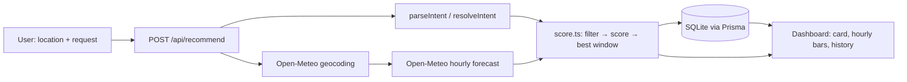

# WeekendWise

WeekendWise finds the best weather window for an outdoor activity. You type a location and a natural-language request; the app parses it into a structured intent, geocodes the location, scores every matching forecast hour deterministically, and recommends the best contiguous time window — storing every search in SQLite and showing it all on a one-page dashboard.

Try the demo sentence: **"I want to go running tomorrow evening when it's cool and unlikely to rain"** with location **Skopje**.

## Run locally

Requires **Node 20+** (built and tested on Node v24.2.0). No API key is needed — Open-Meteo is free and unauthenticated.

```bash
npm install
cp .env.example .env        # PowerShell: Copy-Item .env.example .env
npm run db:push
npm run dev
```

Then open http://localhost:3000. Also useful:

```bash
npm test           # 16 unit tests (scorer + parser)
npm run typecheck  # tsc --noEmit
```

Parsing is deterministic (keyword tables) by default. An **optional LLM parser** can be enabled by setting the `LLM_*` variables in `.env` (any OpenAI-compatible endpoint — OpenAI, Groq, OpenRouter; see `.env.example`). It is validated through the same Zod schema, and on *any* failure — missing key, bad key, timeout, malformed output — the app silently falls back to the keyword parser and keeps working; the result card shows `parsed by: keyword|llm` either way. See the "Demoted the LLM to an optional parser" entry in [docs/ai-log.md](docs/ai-log.md).

## Architecture



```
app/
├── layout.tsx                 # Inter font, off-white canvas, dark footer band
├── page.tsx                   # server component: loads initial history, renders <Dashboard />
├── globals.css                # Tailwind import + design tokens from docs/design.md
└── api/
    ├── recommend/route.ts     # POST: validate → run pipeline → JSON (or mapped error)
    └── history/route.ts       # GET: recent searches, ?limit= clamped 1–50
components/
├── Dashboard.tsx              # client: form/result/status state machine, page sections
├── SearchForm.tsx             # two labelled inputs, submit pill, example chips
├── RecommendationCard.tsx     # chips, resolved location, window, score, metric tiles, breakdown
├── HourlyScores.tsx           # pure-CSS bar chart, blue outline on the recommended window
├── RecentSearches.tsx         # history rows with relative time and mean score
├── StatusMessage.tsx          # error / empty / no-window box
└── ui.tsx                     # tiny primitives: SectionLabel, Card, Pill, Tag
lib/
├── types.ts                   # all domain types + Zod schemas — the contract every module imports
├── errors.ts                  # AppError + error → HTTP response mapping
├── openMeteo.ts               # geocode(), fetchHourlyForecast() — the only file that talks to the API
├── intent.ts                  # keyword parser + timezone-aware intent resolution
├── score.ts                   # deterministic scoring + best-window search (pure functions)
├── pipeline.ts                # runRecommendation(): the whole flow in six lines
├── db.ts                      # prisma singleton, saveSearch(), listRecentSearches()
└── intentLlm.ts               # optional LLM parser (OpenAI-compatible endpoint, Zod-validated, falls back)
tests/
├── score.test.ts              # 11 scorer tests
├── intent.test.ts             # 5 parser tests (incl. the Auckland timezone proof)
└── fixtures.ts                # makeHour / makeIntent / makeDay builders
prisma/schema.prisma           # the single Search model
docs/design.md                 # visual style reference (tokens pasted into globals.css)
docs/ai-log.md                 # AI development log
```

## How the scoring works

From the top of [lib/score.ts](lib/score.ts):

> 1. Keep only hours inside the requested days, time-of-day, and daylight.
> 2. Score each hour 0–100 per metric: temperature vs the ideal band, rain and wind vs the user's tolerance, clouds mildly. Weighted sum = score.
> 3. Slide a window of the requested length over contiguous hours; every hour must clear MIN_ACCEPTABLE_HOUR_SCORE. Highest mean wins; ties → earliest.

| Metric | Weight | Shape |
|---|---|---|
| temperature | 0.40 | 100 inside the ideal band, −10 per °C outside (TEMP_FALLOFF_PER_DEGREE) |
| precipitation | 0.35 | linear 100 → 0 from 0 % up to the user's max tolerated probability |
| wind | 0.15 | same linear shape as precipitation |
| cloud | 0.10 | full overcast scores 50, not 0 (CLOUD_PENALTY_AT_OVERCAST) — clouds rarely stop an activity |

`MIN_ACCEPTABLE_HOUR_SCORE = 35`: a window is only valid if **every** hour clears this floor, so one bad hour can't hide inside a good average. All constants sit at the top of `score.ts` for easy live tweaking.

## External API

Two Open-Meteo endpoints, both keyless:

- **Geocoding** — `https://geocoding-api.open-meteo.com/v1/search?name={query}&count=1&language=en&format=json` → name, country, coordinates, IANA timezone.
- **Forecast** — `https://api.open-meteo.com/v1/forecast?latitude=…&longitude=…&hourly=temperature_2m,apparent_temperature,precipitation_probability,precipitation,wind_speed_10m,cloud_cover,is_day&timezone=auto&forecast_days=7`

`timezone=auto` is the load-bearing parameter: Open-Meteo returns hour timestamps **already local to the location** (`2026-08-28T17:00`, no offset). Because intent resolution also computes dates in the location's timezone, all later filtering is plain string comparison — no timezone library anywhere.

## What is stored and why

One Prisma model, `Search` — every request writes exactly one row, including "no suitable window" results (a negative answer is still useful history).

- `id` — cuid primary key. `createdAt` — orders the history list.
- `locationInput` / `requestText` — exactly what the user typed, for reproducing a search.
- `resolvedName`, `latitude`, `longitude`, `timezone` — what geocoding decided, so a row is interpretable without re-geocoding.
- `activityLabel`, `parserUsed` — what the parser understood and which parser produced it.
- `intentJson`, `resultJson` — the full resolved `Intent` and `Recommendation` as JSON strings; Prisma's SQLite connector has no `Json` column type, and these are read-mostly blobs kept for auditability and future re-rendering.
- `bestWindowStart`, `bestWindowEnd`, `meanScore` — **denormalized** copies of the three values the history list displays, so listing recent searches never parses JSON.

## AI tools used

- **Claude Code** (Anthropic, model Claude Fable 5) — built the app end-to-end from a phased build prompt with per-phase definition-of-done gates; every non-obvious decision, bug, and rejected suggestion is logged in [docs/ai-log.md](docs/ai-log.md).
- **playwright-core + headless Edge** — throwaway script (kept outside the repo) used to verify the browser-only checks: rendered sections, blue window outline, error box, blocked empty submit, 375 px no-overflow.

## Error handling

| Code | HTTP | Raised in | UI shows |
|---|---|---|---|
| `INVALID_INPUT` | 400 | route: Zod validation of the body, or a malformed JSON body | the first Zod issue message |
| `LOCATION_NOT_FOUND` | 404 | `openMeteo.geocode()` when geocoding returns no results | We couldn't find "…". Try adding a country. |
| `WEATHER_UNAVAILABLE` | 502 | `openMeteo.ts` on network error, timeout, non-2xx, or unexpected response shape | The weather service didn't respond. Please try again in a moment. |
| `INTERNAL` | 500 | `toErrorResponse()` catch-all (logged server-side) | Something unexpected happened. Please try again. |

A `null` best window is **not** an error — it returns 200 with a reason (`NO_HOURS_IN_RANGE` or `NO_ACCEPTABLE_WINDOW`) and the UI explains what to change.

## What I'd do with another 4 hours

- Location disambiguation: fetch `count=5` geocoding results and let the user pick when ambiguous ("Springfield").
- Stretch the window beyond `minDurationHours` while hours keep clearing the floor, instead of fixed-length windows.
- Cache Open-Meteo responses keyed by `(lat, lon, forecast-hour)` — repeated searches for the same city currently refetch.
- Per-user history behind lightweight auth instead of one global list.
- "Compare two locations" mode reusing the same scorer on two forecasts.
- Broader parser vocabulary (weekday names, "early morning", temperature numbers like "under 20 degrees").
- One Playwright E2E test of the demo flow, promoted from the throwaway verification script.

## Production / deployment

**Database.** SQLite is wrong for production: a single-writer file with no concurrency story, no managed backups, and it disappears on serverless/ephemeral filesystems. Switch the Prisma datasource from `sqlite` to `postgresql`, point `DATABASE_URL` at managed Postgres (Neon/Supabase if deploying on Vercel; Postgres in Docker on a VPS otherwise), and replace `db push` with real `prisma migrate` migrations.

**App.** Either Vercel (zero-config for Next.js) or a multi-stage Docker image (`next build` → `next start`) on a VPS behind a reverse proxy. Secrets only via environment variables; if the LLM parser is ever enabled, its key stays server-side — route handlers are the only callers.

**Observability.** Sentry for uncaught errors on both routes; structured request logs (route, duration, error code) with a request ID per call so a user report can be traced to one line.

**Scaling to ~500 employees.** SSO auth with per-user history; cache Open-Meteo responses by `(lat, lon, hour)` because colleagues in the same city request identical forecasts; rate-limit any LLM path per user; connection pooling (PgBouncer or Prisma's pool) since serverless functions multiply connections; a `/api/health` endpoint for the load balancer; CI running `typecheck` + `test` on every push so main stays deployable.
